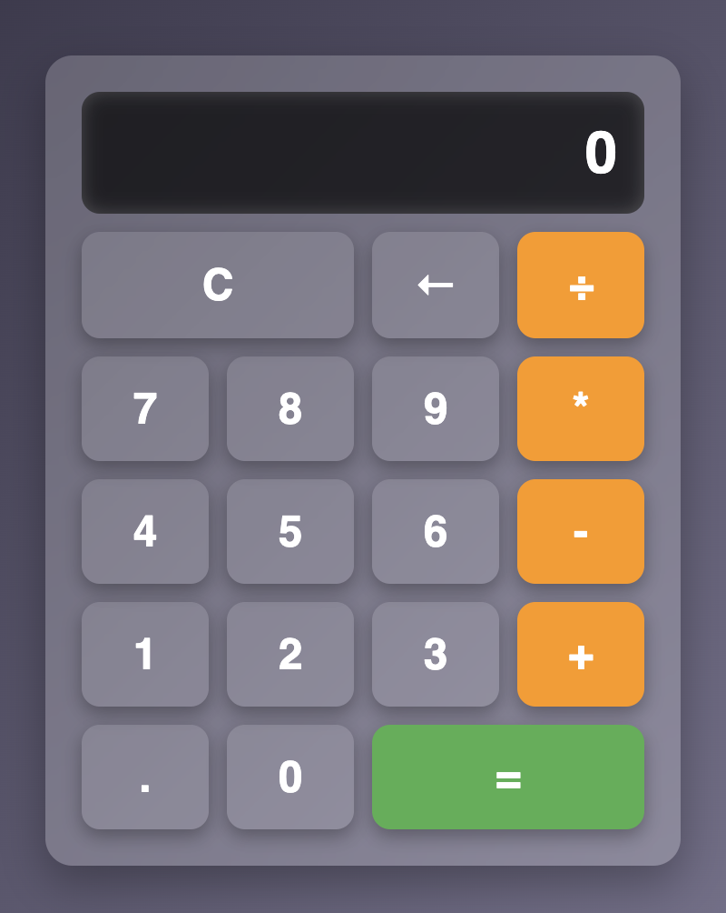

# Calculator App

A simple and responsive calculator application built using JavaScript. This app allows users to perform basic arithmetic operations such as addition, subtraction, multiplication, and division.

# 🌐 Live Demo
You can also view the live version of the calculator app here: Live Demo 🚀

## Screenshots

## Features

- **Basic Arithmetic Operations**: Perform addition, subtraction, multiplication, and division.
- **Responsive Design**: Works seamlessly on different screen sizes.
- **Clear and Delete**: Clear the entire input or delete the last entered digit.
- **Decimal Support**: Perform calculations with decimal numbers.
- **Real-Time Display**: Updates the display dynamically as you input numbers and operators.

## Technologies Used

- **HTML**: For structuring the calculator layout.
- **CSS**: For styling the calculator and making it visually appealing.
- **JavaScript**: For implementing the calculator's functionality.

## File Structure
Calculator 2/ ├── index.html # Main HTML file for the calculator ├── style2.css # CSS file for styling the calculator ├── script.js # JavaScript file for calculator logic

## How to Use

1. Clone or download the repository.
2. Open the `index.html` file in your browser.
3. Use the buttons to perform calculations:
   - Enter numbers using the number buttons.
   - Use the operator buttons (`+`, `-`, `*`, `÷`) to perform operations.
   - Use the `C` button to clear the display.
   - Use the `←` button to delete the last entered digit.
   - Use the `=` button to calculate the result.

## License

This project is open-source and available under the [MIT License](LICENSE).

## Author

Developed by Aryan Raj.